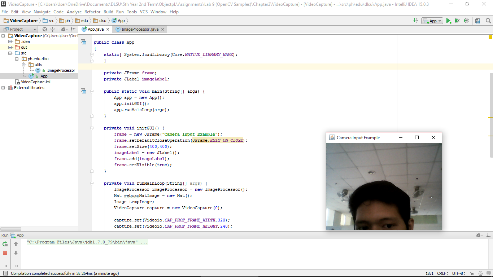

#VideoCapture

Learning to access the camera connected on a compter.

#ScreenShot

#Code

###App
~~~
package ph.edu.dlsu;

import org.opencv.core.Core;
import org.opencv.core.Mat;
import org.opencv.videoio.VideoCapture;
import org.opencv.videoio.Videoio;
import ph.edu.dlsu.utils.ImageProcessor;

import javax.swing.*;
import java.awt.*;

public class App
{
    static{ System.loadLibrary(Core.NATIVE_LIBRARY_NAME);
    }

    private JFrame frame;
    private JLabel imageLabel;

    public static void main(String[] args) {
        App app = new App();
        app.initGUI();
        app.runMainLoop(args);
    }

    private void initGUI() {
        frame = new JFrame("Camera Input Example");
        frame.setDefaultCloseOperation(JFrame.EXIT_ON_CLOSE);
        frame.setSize(400,400);
        imageLabel = new JLabel();
        frame.add(imageLabel);
        frame.setVisible(true);
    }

    private void runMainLoop(String[] args) {
        ImageProcessor imageProcessor = new ImageProcessor();
        Mat webcamMatImage = new Mat();
        Image tempImage;
        VideoCapture capture = new VideoCapture(0);

        capture.set(Videoio.CAP_PROP_FRAME_WIDTH,320);
        capture.set(Videoio.CAP_PROP_FRAME_HEIGHT,240);

        if( capture.isOpened()){
            while (true){
                capture.read(webcamMatImage);
                if( !webcamMatImage.empty() ){
                    tempImage= imageProcessor.toBufferedImage(webcamMatImage);
                    ImageIcon imageIcon = new ImageIcon(tempImage, "Captured video");
                    imageLabel.setIcon(imageIcon);
                    frame.pack();  //this will resize the window to fit the image
                }
                else{
                    System.out.println(" -- Frame not captured -- Break!");
                    break;
                }
            }
        }
        else{
            System.out.println("Couldn't open capture.");
        }

    }
}
~~~

###ImageProcessor
~~~
package ph.edu.dlsu.utils;

import org.opencv.core.Mat;

import java.awt.image.BufferedImage;
import java.awt.image.DataBufferByte;

//package org.javaopencvbook.utils;

public class ImageProcessor {

    public BufferedImage toBufferedImage(Mat matrix){
        int type = BufferedImage.TYPE_BYTE_GRAY;
        if ( matrix.channels() > 1 ) {
            type = BufferedImage.TYPE_3BYTE_BGR;
        }
        int bufferSize = matrix.channels()*matrix.cols()*matrix.rows();
        byte [] buffer = new byte[bufferSize];
        matrix.get(0,0,buffer); // get all the pixels
        BufferedImage image = new BufferedImage(matrix.cols(),matrix.rows(), type);
        final byte[] targetPixels = ((DataBufferByte) image.getRaster().getDataBuffer()).getData();
        System.arraycopy(buffer, 0, targetPixels, 0, buffer.length);
        return image;
    }

}
~~~
